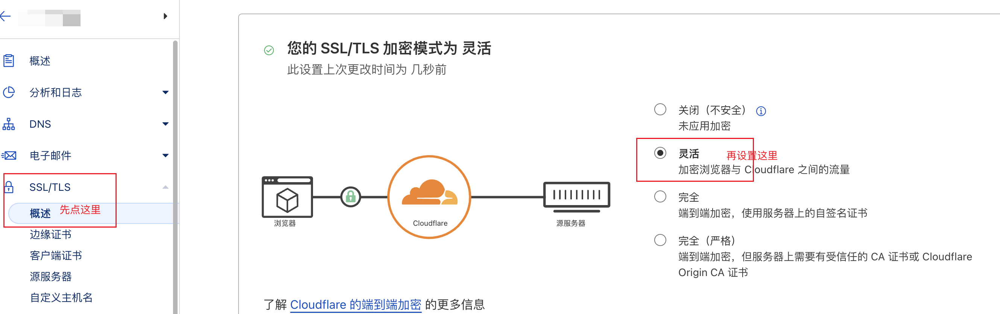
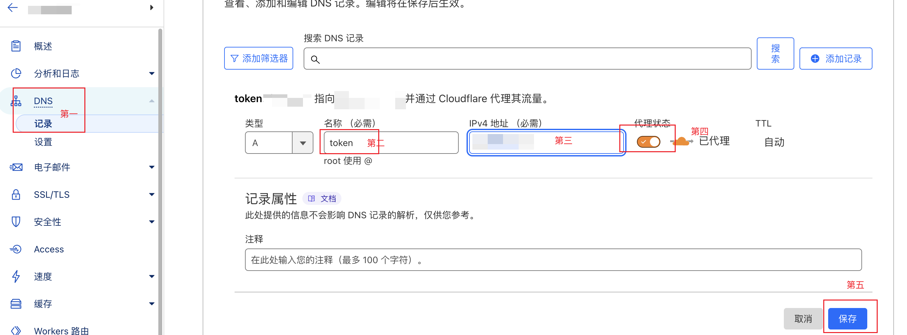

# SSL配置教程

是否配置SSL并不会影响使用，但是部分强迫症患者肯定不爽，受不了各种浏览器提示不安全；但是软件自身目前不支持直接配置SSL，没关系，我们可以用过常见的WEB服务器配置反向代理完成SSL安装。这里给出两种案例，其他软件大同小异。

## Cloudflare

`Cloudflare`本身可以自己维护SSL证书非常方便，我们只需要配置好DNS解析，配置好反向代理即可。

### 操作步骤

1. 保证 `USDTMore` 安装成功，监听端口推荐80，保证`http://你的服务器IP/`能正常访问。
2. 设置`SSL/TLS`模式为`灵活`
   
3. 添加二级域名解析，设置DNS，打开小云朵，最后保存。
   

**等待解析生效，访问刚才解析的二级域名，能访问则说明正常。**

**如果没意外，现在打开`https://你的域名/`应该能够正常访问啦！**