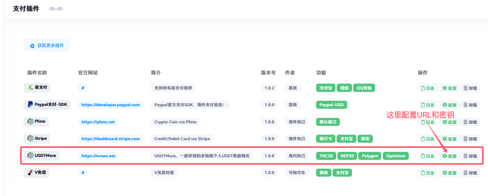
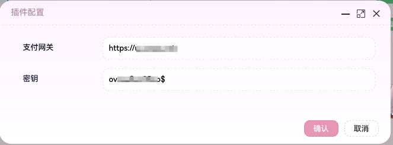
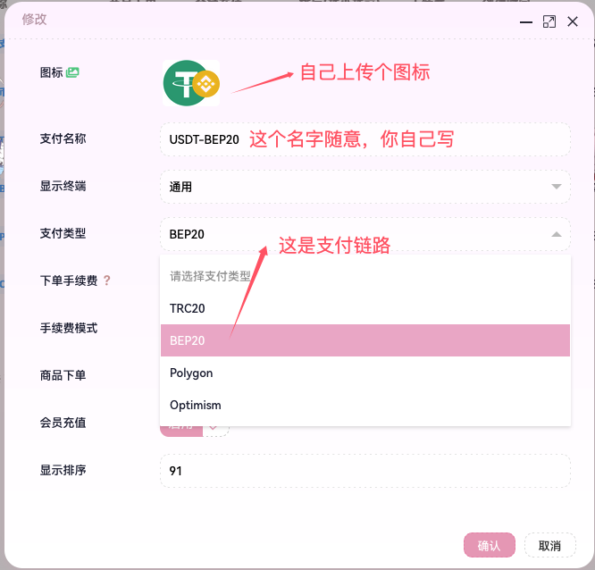
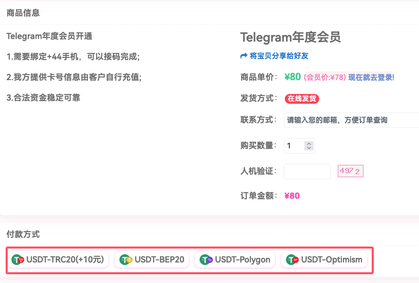

## 使用方法

1.将`USDTMore`目录里面的文件复制到 `/app/Pay` 下面

2.登录异次元后台，进入支付管理，支付插件， 这时候会看到USDTMore插件

3.配置对应的URL和密钥，其中URL就是你的USDTMore的地址，不需要加后缀， 密码在USDTMore的插件配置文件/etc/usdtmore.conf中

4.进入支付管理，支付接口中增加支付方式

5.回调代码的修改，主要涉及2处

* app/Controller/User/Api/RechargeNotification.php，在return之前增加解码代码

        // 增加usdt的处理逻辑
        if($handle =='USDTMore'){
            $data = json_decode(file_get_contents('php://input'),true);
        }

        return $this->recharge->callback($handle, $data);

* app/Controller/User/Api/Order.php，在获取参数之后增加解码代码

        $handle = $_GET['_PARAMETER'][0];
        $data = $_POST;
        if (empty($data)) {
            $data = $_REQUEST;
            unset($data['s']);
        }
        
        // 增加usdt的处理逻辑
        if($handle =='USDTMore'){
            $data = json_decode(file_get_contents('php://input'),true);
        }

6.最终的效果如下

